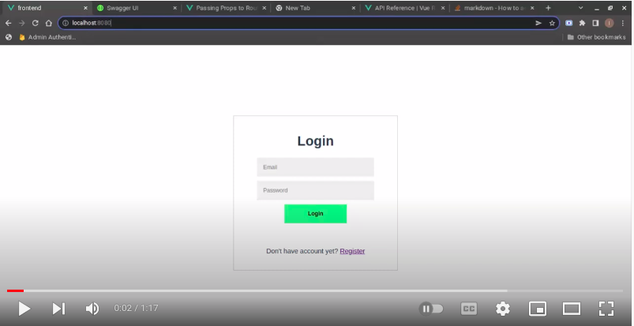

### Login And Register app using (MongoDB - Fastify - VueJS - NodeJS)

#### how to run
```
cd ./backend
npm run start
cd ../frontend
npm run serve
```

#### Screens
###### Register

###### Login

###### Users


#### [Video](https://youtu.be/db5MSSKSO3I) 
[](https://youtu.be/db5MSSKSO3I)

